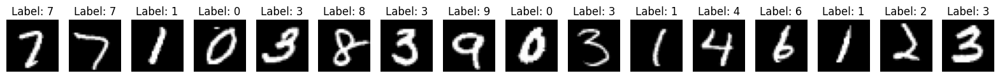

# MNIST Dataset Handwirriten Digit Classification using CNN

This project implements a Convolutional Neural Network (CNN) to classify handwritten digits from the MNIST dataset using PyTorch.

## Introduction

The MNIST dataset is a large database of handwritten digits that is commonly used for training various image processing systems. This project uses a CNN to classify the digits with high accuracy.



Sure, here's the dependencies part with icons:

---

## Dependencies

This project requires the following libraries:


You can install the required libraries using the following command:

```bash
pip install torch torchvision numpy matplotlib tqdm scikit-learn
```

---
## Model Architecture

The CNN model used in this project consists of the following layers:

- Convolutional layers with ReLU activation
- MaxPooling layers
- Fully connected layers

## Results

The model achieves a high accuracy on the MNIST test set. 
Here's the results section with the accuracy by class presented in a table format:

---

## Results

### Test Loss: 0.032940

#### Test Accuracy by Class:

| Class | Accuracy |
|-------|----------|
| 0     | 99% (977/980) |
| 1     | 99% (1128/1135) |
| 2     | 98% (1020/1032) |
| 3     | 99% (1000/1010) |
| 4     | 98% (971/982) |
| 5     | 99% (884/892) |
| 6     | 98% (945/958) |
| 7     | 98% (1016/1028) |
| 8     | 98% (960/974) |
| 9     | 98% (993/1009) |

#### Overall Test Accuracy: 98% (9894/10000)

## Contributing

Contributions are welcome! Please fork the repository and submit a pull request.

Sure, here's the license part with the MIT license logo:

---

## License

This project is licensed under the MIT License. 

---
